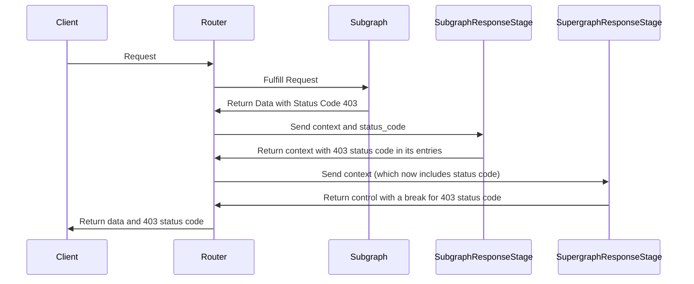

# Status Code Forwarding

This repository demonstrates how to setup a coprocessor that forwards status codes from the subgraph to the client.

## Running the Example

> Note: To run this example, you will need a GraphOS Enterprise plan and must create `/router/.env` based on `/router/.env.example` which exports `APOLLO_KEY` and `APOLLO_GRAPH_REF`.

1. Run the subgraph from the `/subgraph` directory with `npm run dev`
1. Run the coprocessor from the `/coprocessor` directory with `npm run dev`.
1. In the `/router` directory, download the router by running `./download_router.sh`
1. In the `/router` directory, compose the schema by running `./create_local_schema.sh` (NOTE - the subgraph has to be running for this to work as this script relies on introspecting the subgraph schema)
1. In the `/router` directory, run the router by running `./start_router.sh`

Now if you run this code in the browser (http://127.0.0.1:4000/), you will be able to query the router.
You will be able to how the coprocessor transforms the `context` and `control` fields in the coprocessor's console output.

If you run the query below:
```
query Query {
  hello
}
```

you should see the response (with an error code 403 instead of 200):
```
{
  "data": {
    "hello": "Hello World!"
  },
  "errors": [
    {
      "message": "HTTP fetch failed from 'subgraph': 403: Forbidden",
      "path": [],
      "extensions": {
        "code": "SUBREQUEST_HTTP_ERROR",
        "service": "subgraph",
        "reason": "403: Forbidden",
        "http": {
          "status": 403
        }
      }
    }
  ]
}
```

## How it works

The `SubgraphResponseStage` and `SupergraphResponseStage` are both part of the coprocessor. The coprocessor listens on one port for both of these stages and handles which one it evaluates based on the `stage` passed in the request to the coprocessor.

There are comments in the code for the subgraph, coprocessor and router config explaining what each part of the code is doing.
